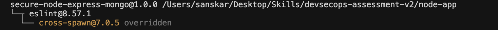
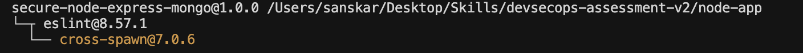
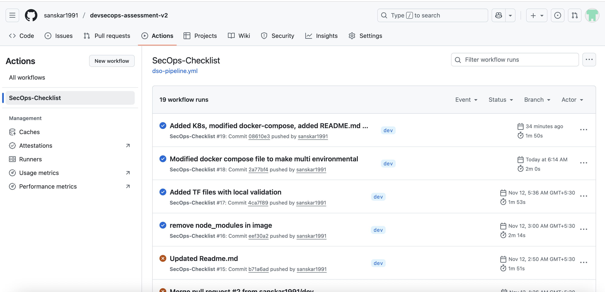
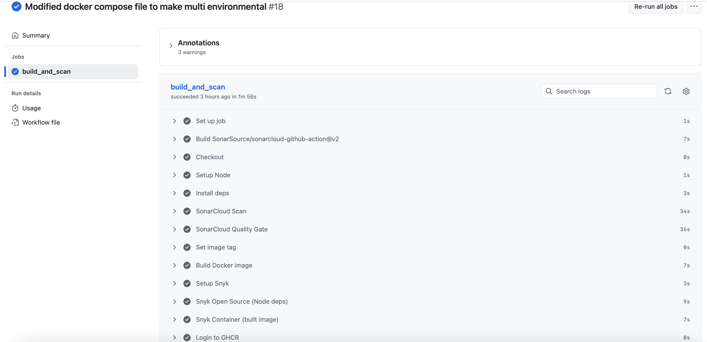
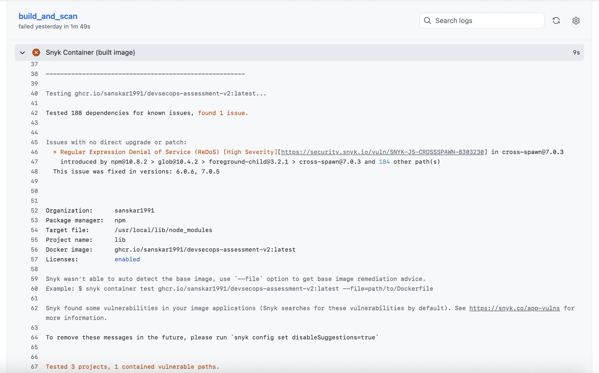
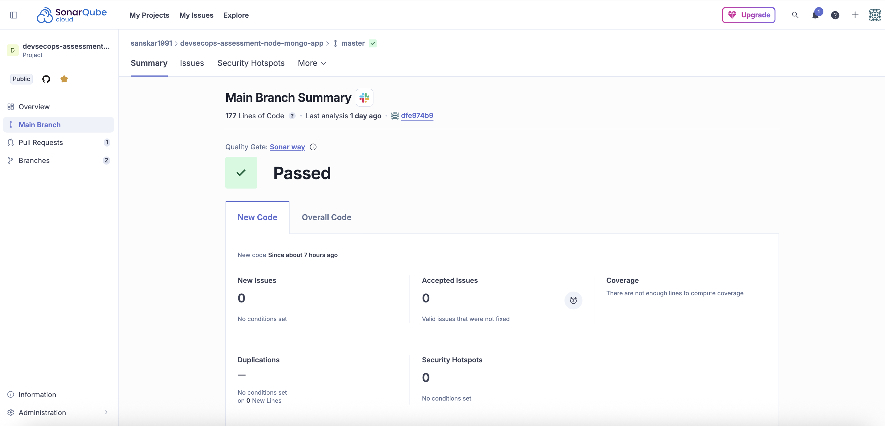
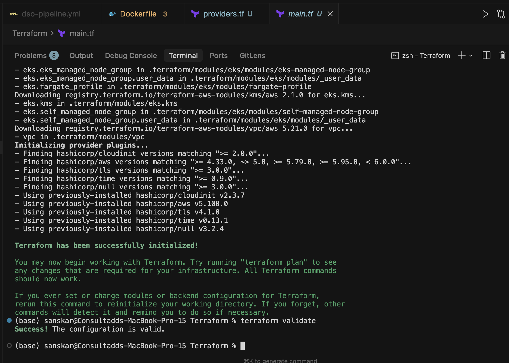
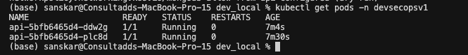
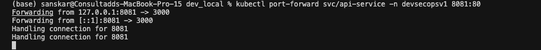

# DevSecOps Assessment Evidence

This document contains all required outputs, screenshots, logs, reports, and evidence requested as part of the DevSecOps Assessment.

Organized by section for easy validation.

## Section 1 – Docker & Image Hardening

### 1.1 Dockerfile

- Dockerfile: (`./node-app/Dockerfile`)
- Dockerfile.dev: (`./node-app/Dockerfile.dev`)
- Multistage, production-ready Docker Compose file: (`./node-app/docker-compose.yml`)
- Local run Docker Compose file:  (`./node-app/docker-compose.dev.override.yml`)
- API endpoints (`/healthz`, `/readyz`)
- Rate-limiting response (HTTP 429)
- Local execution (`npm start`)

---

### 1.2 Scan results (trivy.txt)

- Trivy scan output file location:
  - Finding: (`trivy_scanning/trivy-scan-v1.txt`)
  - Resolved: (`trivy_scanning/trivy-scan-v2.txt`)

### Screenshots:
1. Vuln found: 
2. Vuln resolved: 

---

## Section 2 – CI/CD Pipeline (GitHub Actions + Snyk + SonarCloud + GHCR)

### 2.1 GitHub Actions Pipeline

- Workflow file: (`.github/workflows/dso-pipeline.yml`)
- Successful pipeline run
- Job-level logs for:
  - Build
  - SonarCloud scan
  - Snyk Open Source scan
  - Snyk Container scan
  - Image push to GHCR

### Screenshots:
1. Multiple build passing: 
2. Build stages passed: 
3. Snyk faild on High vuln: 
4. SonarCloud Report: 

---

## Section 3 – Infrastructure as Code (Terraform)

### 3.1 Terraform Files

- Terraform validation ran successfully: 

---

## Section 4 – Kubernetes Deployment

### 4.1 Kubernetes Manifests

- Namespace
- ConfigMaps
- Secrets
- Mongo StatefulSet
- Mongo Service
- Node Deployment
- Node Service
- NetworkPolicy
- HPA
- PDB
- Ingress

---
### Screenshots:
1. Kubectl dry run: 
2. Kubectl get Pods: 
3. K8s app runing and port forwarding: 

#### All screenshots are added to this RESULTS.md file
